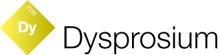

Dysprosium is part of the **[E-sites iOS Suite](https://github.com/e-sites/iOS-Suite)**.

---

Deallocation helper for runtime objects.   
This library is pure for debugging purposes.

[](http://forthebadge.com) [](http://forthebadge.com)

[](http://cocoadocs.org/docsets/Dysprosium)
[](http://cocoadocs.org/docsets/Dysprosium)
[](https://cocoapods.org/pods/Dysprosium/quality)
[](https://travis-ci.org/e-sites/Dysprosium)
[](https://github.com/Carthage/Carthage)


# Installation

Podfile:

```ruby
pod 'Dysprosium'
```

And then

```
pod install
```

# Implementation

```swift
// AppDelegate


func application(_ application: UIApplication, didFinishLaunchingWithOptions launchOptions: [UIApplicationLaunchOptionsKey: Any]?) -> Bool {
    // ...
    
    Dysprosium.shared.onDealloc { objects in 
        print("[INFO] Deallocated objects: \(objects)")
    }
    
    Dysprosium.shared.onExpectedDeallocation { object, message in 
        print("[WARNING] Expected deallocation of \(object): \(message)")
    }
}

```

## Log deallocations

This way you can easily see what objects have been deallocated.

```swift
import Dysprosium

class SomeObject: DysprosiumCompatible {
    // ...
    
    deinit {
        deallocated()
    }
}
```

## Expect deallocations


### UIViewController
Most of the time when a `UIViewController` disappears it should be deallocated.   
With `expectDeallocation()` you can monitor if it actually is deallocated.

```swift
import Dysprosium

class SomeViewController: UIViewController, DysprosiumCompatible {
    // ...
    
    override func viewDidDisappear(_ animated: Bool) {
        super.viewDidDisappear(animated)
        expectDeallocation()
    }
    
    deinit {
        deallocated()
    }
}
```

### Related objects

If an object gets deallocated, but you need to check that an underlying object is deallocated as well:

```swift
import Dysprosium

class SomeObject: DysprosiumCompatible {
    // ...
    
    let relatedObject: SomeObject

    deinit {
        relatedObject.expectDeallocation()
        deallocated()
    }
}
```

## Release builds

Disable Dysprosium like this:

```swift
Dysprosium.shared.isEnabled = false
```